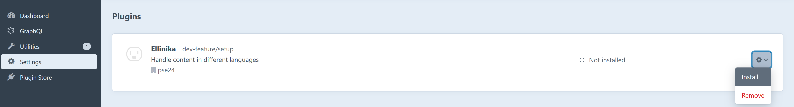

# Anleitung Plugin Ellinika Installation für Craft CMS 5.X

Stelle Sie sicher, dass Docker Desktop geschlossen ist. Dies kann zu Konflikten führen.

Öffne den Explorer. Navigiere zum Pfad **innerhalb der Craft-Installation** (Ubuntu: `/home/user_name/my-craft-project/`). Wir installieren das Plugin nun so, dass die Struktur schlussendlich so aussieht:

```bash
.
└── my-craft-project
    ├── bootstrap.php
    ├── composer.json
    ├── composer.lock
    ├── config
    ├── craft
    ├── pse-2024
    ├── storage
    ├── templates
    ├── vendor
    └── web
```


Klonen sie dieses Github Repository in ihr Craft Projekt:

```bash
git clone https://github.com/devedis/pse-2024.git
```


Öffne Sie nun my-craft-project/composer.json in einem beliebigen Texteditor. Füge Code an, dass die Datei so aussieht:

```json
{
    "minimum-stability": "dev",
    "prefer-stable": true,
    "repositories": [
        {
            "type": "path",
            "url": "./pse-2024/ellinika"
        }
    ],
    // Restlicher json Code (ungeändert)
    "require": {
        ...
```

Öffne Sie Ubuntu (oder sonstiges Terminal, wo ddev/Craft installiert wurde).

Installiere Composer, falls noch nicht vorhanden:

```bash
sudo apt install composer
```

Navigiere Sie zum Pfad, dass man im craft-cms-projekt ist. Kontrolle:

```bash
ls
```

Jetzt sollte folgendes stehen:

```
bootstrap.php composer.json composer.json composer.lock config craft storage templates vendor web
```

Wir spielen jetzt die Dependency von unserem Plugin an Composer von unserer Website zu:
pse/craft-ellinika ist der Handle von dem Plugin Ellinika.

```bash
composer require pse/craft-ellinika
```

WICHTIG: Falls bei diesem Schritt Fehlermeldungen kommen, dass Pakete fehlen, gib diesen Befehl ein:

```bash
sudo apt install php8.2-bcmath php8.2-curl php8.2-dom php8.2-zip php8.2-intl
```


Öffne Sie Docker Desktop und im starten Sie die Container mit folgendem Befehl im Terminal:

```bash
ddev start
```

Falls sich ddev nicht starten lässt, weil Port 80 bereits in use ist, diesen Befehl eingeben:

```bash
sudo service apache2 stop
```
```bash
ddev start
```

Folge dem Link, gehe ins Dashboard \< Settings \< Plugins.

Installieren Sie das Plugin:



Das Plugin ist nun installiert. Auf der Seitenleiste links sollte das Plugin einen eigenen Tab haben.