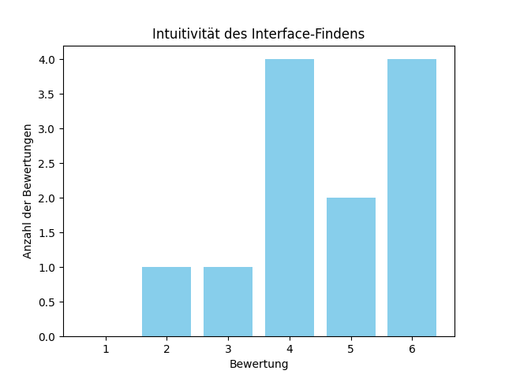

# GUI Testdokumentation

## Usability Test

Der Usability-Teil des GUI-Test des Ellinika Plugins wurde durchgeführt, um die Benutzerfreundlichkeit und Reaktionsfähigkeit des Interfaces zu bewerten. Die Teilnehmer wurden gebeten, verschiedene Aufgaben zu erledigen, und ihre Erfahrungen wurden anhand von Fragen bewertet. Die Bewertungen reichten von 1 (sehr unintuitiv) bis 6 (sehr intuitiv). Zusätzlich wurden die Gesamtzeiten für alle Aufgaben gemessen, um eine objektive Bewertung der Effizienz zu ermöglichen. Basierend auf den Ergebnissen wurden Rückmeldungen und Verbesserungsvorschläge gesammelt.

### Fragen und Ergebnisse

1. **Wie intuitiv war es, das Ellinika Interface zu finden?**
   - **Ergebnisse**: 
     - Durchschnitt: 4.58 (Bewertung von 1-6)
     - 

2. **Wie intuitiv war es, einen Eintrag (Entry) in Ellinika zu übersetzen?**
   - **Ergebnisse**:
     - Durchschnitt: 4.25 (Bewertung von 1-6)
     - 

3. **Wie intuitiv war es herauszufinden, ob die englische Version des Eintrags sich von der deutschen unterscheidet?**
   - **Ergebnisse**:
     - Durchschnitt: 3.83 (Bewertung von 1-6)
     - 

4. **Wie intuitiv war es, auf die Entry Links in Ellinika zuzugreifen?**
   - **Ergebnisse**:
     - Durchschnitt: 2.83 (Bewertung von 1-6)
     - 

5. **Wie intuitiv war es, eine Sprachversion des Eintrags aus der Tabelle zu löschen?**
   - **Ergebnisse**:
     - Durchschnitt: 5.5 (Bewertung von 1-6)
     - 

6. **Wie intuitiv sind die Einstellungen für das Plugin Ellinika?**
   - **Ergebnisse**:
     - Durchschnitt: 5.08 (Bewertung von 1-6)
     - 

7. **Gib uns doch bitte Rückmeldungen, welche Funktionalitäten gut positioniert waren und was wir verbessern könnten.**
   - **Rückmeldungen**:
     - Die Rückmeldungen richteten sich ausschliesslich zur Frage 4: Die Intuitivität auf die Entry Links zuzugreifen war ungenügend. Es wurde erwünscht, eine Markierung, einen Knopf oder eine Beschreibung für diese Funktion hinzuzufügen.

### Zeitmessungen

Zusätzlich zu den subjektiven Bewertungen wurde die Gesamtzeit gemessen, die die Teilnehmer für die Durchführung aller Aufgaben benötigten. Dies ermöglicht eine objektive Bewertung der Benutzerfreundlichkeit.

- **Durchschnitt der Gesamtzeit für alle Aufgaben**: 5 Minuten und 20 Sekunden

## Responsivenesstest

Im Responsiveness Test wird manuell überprüft, wie verschiedene Elemente des Plugins auf dem GUI aussehen. Dies beinhaltet die folgenden Aspekte:

- **Entries mit grossen Texten**: Überprüfung, wie Einträge mit umfangreichen Textinhalten im Interface dargestellt werden.
- **Websites mit vielen Sprachen**: Sicherstellen, dass das Plugin korrekt mit mehrsprachigen Websites funktioniert und die Benutzeroberfläche entsprechend anpasst.
- **Gängige Auflösungen**: Testen des Plugins auf verschiedenen Bildschirmauflösungen, um sicherzustellen, dass die Darstellung auf allen gängigen Monitoren einwandfrei ist.
- **Skalierungen und Fenstergrössen**: Überprüfen, wie das Plugin bei verschiedenen Skalierungen und Fenstergrössen reagiert, um sicherzustellen, dass das Layout flexibel und benutzerfreundlich bleibt.
- **Verschiedene Internet-Browser**: Manuelles Testen des Plugins auf verschiedenen Browsern (z.B. Chrome, Firefox, Safari), um die Kompatibilität und Konsistenz der Darstellung zu gewährleisten.

Da Craft CMS nur auf Computern verwendet wird, können Tests auf mobilen Geräten und Touch-Eingaben vernachlässigt werden.

### Durchführung des Responsivenesstests

Der Responsivenesstest wurde durch manuelle Inspektion und Anpassung der Browserfenster sowie der Nutzung von Entwicklerwerkzeugen durchgeführt, um die oben genannten Aspekte zu überprüfen. Folgende Schritte wurden unternommen:

1. **Testen mit grossen Texten**:
   - Erstellen von Einträgen mit umfangreichen Textinhalten.
   - Überprüfen, ob diese Einträge korrekt und vollständig im Interface dargestellt werden.

2. **Mehrsprachige Websites**:
   - Testen des Plugins auf Websites mit verschiedenen Sprachversionen.
   - Sicherstellen, dass die Sprachauswahl und die Inhalte korrekt geladen und angezeigt werden.

3. **Unterschiedliche Bildschirmauflösungen**:
   - Ändern der Bildschirmauflösung in den Systemeinstellungen und Überprüfen der Darstellung des Plugins.
   - Sicherstellen, dass das Layout auf allen gängigen Auflösungen korrekt funktioniert.

4. **Skalierungen und Fenstergrössen**:
   - Anpassen der Fenstergrösse im Browser und Überprüfen, wie sich das Layout des Plugins verhält.
   - Testen bei verschiedenen Skalierungsstufen (z.B. 100%, 125%, 150%) und Sicherstellen, dass das Interface weiterhin benutzerfreundlich bleibt.

5. **Verschiedene Browser**:
   - Öffnen des Plugins in verschiedenen Browsern (Chrome, Firefox, Safari).
   - Überprüfen der Darstellung und Funktionalität, um Browser-Kompatibilität sicherzustellen.

### Ergebnisse

Der Responsivenesstest hat bestätigt, dass das Plugin `Ellinika` unter verschiedenen Bedingungen korrekt und benutzerfreundlich dargestellt wird. Die folgenden Punkte wurden erfolgreich überprüft:

- Einträge mit grossen Texten werden korrekt und vollständig dargestellt.
- Das Plugin funktioniert einwandfrei auf mehrsprachigen Websites und zeigt die Inhalte in der gewählten Sprache korrekt an.
- Die Darstellung des Plugins ist auf allen getesteten Bildschirmauflösungen konsistent und benutzerfreundlich.
- Das Layout bleibt bei verschiedenen Skalierungsstufen und Fenstergrössen flexibel und gut nutzbar.
- Das Plugin zeigt in verschiedenen Browsern eine konsistente und fehlerfreie Darstellung.

Insgesamt hat der Responsivenesstest bestätigt, dass das Plugin `Ellinika` unter verschiedenen Bedingungen stabil und benutzerfreundlich funktioniert, ohne dass Performanceprobleme oder Darstellungsfehler auftreten.
